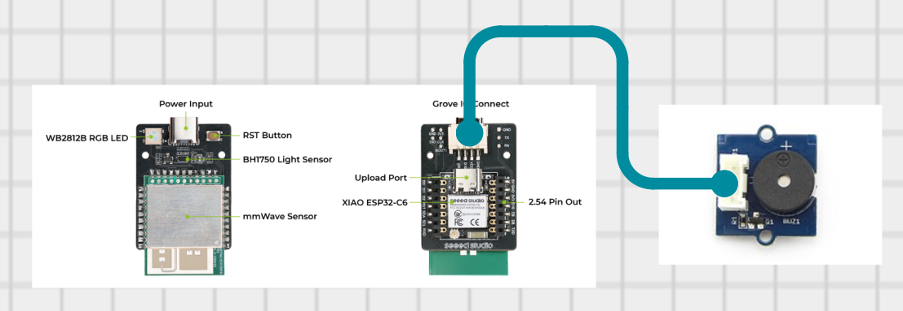
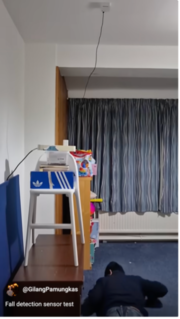

# 🛡️ mmWave-Based Indoor Fall Detection System  
**CASA0016 – Making, Designing & Building Connected Sensor Systems**

An edge-based, privacy-preserving indoor fall detection prototype using a 60 GHz mmWave radar sensor, MQTT communication, and real-time WhatsApp alerts.

---

## 📌 Project Overview

Falls are a major cause of injury among older adults, particularly in indoor environments where rapid detection is critical.  
This project designs, builds, and evaluates an **indoor fall detection prototype** using a **60 GHz mmWave radar sensor** integrated with an **ESP32-based microcontroller**.

Unlike vision-based approaches, the system enables **continuous, non-contact monitoring** while preserving user privacy. Fall detection is performed locally using embedded radar firmware, with **edge-based event handling** triggering both local alerts and remote notifications.

⚠️ **Disclaimer:** This prototype is not a medical device and is intended for educational and exploratory purposes only.

---

## 🧠 Key Capabilities

- Privacy-preserving, non-contact sensing  
- Edge-based fall detection (no raw motion data transmitted)  
- Immediate local alerts (RGB LED + buzzer)  
- Remote notifications via WhatsApp  
- Lightweight IoT communication using MQTT  
- Designed for continuous indoor deployment  

---

## 🏗️ System Architecture

The system follows an **edge-centric, event-driven architecture**:

<p align="center">
  
</p>

<p align="center"><em>Figure 1. high level system architecture</em></p>

### 1️⃣ Sensing & Classification (Edge)
- 60 GHz mmWave radar performs embedded fall detection
- Abstracted states: `no presence`, `presence`, `fall`
- No transmission of raw sensor data

### 2️⃣ Local Feedback
- RGB LED indicates system state
- Audible buzzer activates on confirmed fall events

### 3️⃣ Communication & Alerts
- MQTT publishes lightweight status messages
- WhatsApp alerts sent via HTTP API
- NTP time synchronisation for alert timestamps
- One-time alert logic prevents notification flooding


---

## 🔩 Hardware Components

| Component | Description |
|---------|-------------|
| MR60FDA2 | 60 GHz mmWave fall detection module |
| XIAO ESP32C6 | Embedded microcontroller with Wi-Fi |
| RGB LED (WS2812B) | Visual system state indication |
| Grove Buzzer | Audible fall alert |
| BH1750 | Ambient light sensor (contextual only) |
| Power Supply | 5 V USB (always-on indoor deployment) |

**Mounting:** Ceiling-mounted at ~2.5 m in a residential room.


<p align="center">
  
</p>

<p align="center"><em>Figure 2. MR60FDA2 sensor kit</em></p>

---

## 🧱 Physical Implementation

**Figure:** Physical implementation of the prototype  
- **(a)** Fusion 360 enclosure design  
- **(b)** 3D-printed enclosure with device placement  
- **(c)** Grove buzzer for audible alerts  

<p align="center">
  
</p>

<p align="center"><em>Figure 3. Physical implementation of the prototype: (a) Fusion 360 enclosure design, (b) 3D-printed enclosure with device placement, (c) Grove buzzer for audible alerts</em></p>

📂 Fusion 360 files of enclosure are available in `/enclosure/`.

---

## 💻 Software Stack

- Arduino IDE  
- Seeed Arduino mmWave Library  
- Adafruit NeoPixel Library  
- WiFi & PubSubClient (MQTT)  
- HTTPClient (WhatsApp API)  
- NTP time synchronisation  

Core logic is implemented in a **single Arduino sketch** (/fall_detection_v2.ino) for clarity and reproducibility.

---

## 🔁 Reproducibility Guide

### 🔌 Wiring

Most sensing and processing components are **integrated within the MR60FDA2 kit**.  
External wiring is limited to:

- Grove Buzzer  
- Power supply (USB)

<p align="center">
  
</p>

<p align="center"><em>Figure 4. Wiring Diagram</em></p>


---

### 📍 Pin Mapping

| Component | Pin |
|---------|-----|
| Grove Buzzer | GPIO (external) |
| RGB LED | Integrated |
| mmWave Radar | Integrated |
| BH1750 | Integrated |

---

### ⚙️ Installation Parameters

The following parameters are configured based on the official MR60FDA2 mmWave sensor guidelines and directly influence fall detection behaviour:

| Parameter | Typical Value | Description |
|---------|---------------|-------------|
| Mounting height | ~2.5 m | Recommended ceiling-mounted height for reliable top-down fall detection coverage |
| Detection threshold | Configurable | Vertical displacement threshold used by the embedded fall detection firmware |
| Sensitivity | Medium | Controls radar responsiveness to motion intensity |
| Alert mode | One-time per fall | Prevents repeated notifications from a single detected fall event |

These parameters were tuned to balance detection reliability and false-positive reduction in a residential indoor environment.  
See: *Getting Started with MR60FDA2 mmWave Kit* (Seeed Studio, 2025).


---

### ▶️ Setup Order

1. Mount the device on the ceiling at approximately 2.5 m.
2. Power the system via a 5 V USB supply.
3. Configure Wi-Fi credentials in the Arduino sketch.
4. Configure MQTT broker address and topic settings.
5. Configure WhatsApp notification parameters (TextMeBot API key and chat ID).
6. Set installation parameters (mounting height, detection threshold, sensitivity).
7. Upload the firmware to the ESP32C6.
8. Deploy the system and observe LED state indicators.
9. Test fall detection scenarios and verify local and remote alerts.


---

### 📲 WhatsApp Alert Configuration

Remote fall alerts are delivered using the **TextMeBot WhatsApp API**, a lightweight HTTP-based service that enables WhatsApp message delivery from embedded devices without requiring a dedicated messaging server.

When a fall event is detected, the ESP32 sends an HTTP GET request to the TextMeBot API endpoint, which forwards the alert message to a configured WhatsApp number.

#### 🔑 API Key and Recipient Configuration

To enable WhatsApp notifications, users must obtain a personal **TextMeBot API key** and associate it with their WhatsApp number following the instructions provided by the service. These credentials are user-specific and are therefore not included in this repository.

The following parameters must be configured directly in the Arduino sketch (`.ino` file):

```cpp
// --- WhatsApp (TextMeBot) Configuration ---
// Replace with your own API key and recipient number
const char* TEXTMEBOT_API_KEY = "YOUR_API_KEY";
const char* TEXTMEBOT_RECIPIENT = "+441234567890";  // WhatsApp number including country code
🌐 Message Delivery Mechanism
When a fall is detected, the firmware constructs and sends an HTTP request of the following form:

arduino
Copy code
https://api.textmebot.com/web_send.php?apikey=YOUR_API_KEY&recipient=PHONE_NUMBER&text=MESSAGE
The request is sent using the ESP32 HTTP client library. Message content is URL-encoded to ensure safe transmission. A timestamp obtained via NTP synchronisation is appended to the message to provide temporal context.

🔒 Rate Limiting and Safety
To prevent alert flooding, the system implements a one-time notification mechanism, ensuring that only a single WhatsApp alert is sent per detected fall event until the system state resets. This behaviour improves usability and reflects realistic deployment requirements for indoor safety monitoring systems.
```
---

## 🧪 Evaluation Summary

Testing was conducted in a **room-scale indoor environment** under three scenarios:

1. No occupant present  
2. Normal movement (walking, standing, sitting)  
3. Simulated fall events  

### Key Observations
- Immediate fall detection and alert triggering  
- Stable MQTT publishing  
- No false positives during normal movement  
- Sensitivity to threshold configuration  
- Limited discrimination between falls and slow postural transitions  

🚀 See the project come to life! Watch the demo on Youtube here: [](https://www.youtube.com/shorts/zDeqPK8EPvs)


---

## 🔍 Reflection & Limitations

- Detection behaviour is sensitive to threshold configuration  
- Proprietary radar firmware limits access to raw motion data  
- The system cannot reliably distinguish intentional lying from real falls  
- Design constraints reflect real-world IoT deployment trade-offs  

The project intentionally focuses on **system-level design**, prioritising:
- deployment realism  
- privacy preservation  
- robustness  
- reproducibility  

---

## 🚀 Future Work

- Learning-based fall classification using temporal motion features  
- Access to raw mmWave data for improved semantic accuracy  
- Multi-sensor fusion (e.g. inertial validation)  
- Battery-powered operation  
- Multi-room monitoring dashboard  

---

## 📂 Repository Structure

fall-detection/
├── code/ # Arduino sketches
├── enclosure/ # Fusion 360 and STL files
├── media/ # Diagrams, photos, videos
├── docs/ # Additional documentation
└── README.md


---

## 📄 Coursework Context

- **Module:** CASA0016 – Making, Designing & Building Connected Sensor Systems  
- **Institution:** UCL Centre for Advanced Spatial Analysis, MSc Connected Environments 
- **Author:** Gilang Pamungkas  
- **Date:** December 2025  

📘 The full technical report accompanies this repository.

---

## 📚 References

Huh, H., Jeong, I., Lee, A., Lee, S. and Shin, Y.-S. (2025). Leveraging falling acceleration and body part clustering for physics-based human fall detection with millimeter wave radar. *Engineering Applications of Artificial Intelligence*, 159, 111500.

Seeed Studio (2025). *Getting Started with MR60FDA2 mmWave Kit*. Available at: https://wiki.seeedstudio.com/getting_started_with_mr60fda2_mmwave_kit (Accessed: 30 December 2025).

Shi, W., Cao, J., Zhang, Q., Li, Y. and Xu, L. (2016). Edge computing: Vision and challenges. *IEEE Internet of Things Journal*, 3(5), pp. 637–646.

Wang, Z., Yan, G., Yang, X., Zhao, X., Li, X. and Chai, M. (2023). Research on the fall detection method based on millimeter-wave radar. In: *Proceedings of the 5th International Conference on Intelligent Control, Measurement and Signal Processing (ICMSP 2023)*, pp. 139–142.

World Health Organization (2007). *WHO Global Report on Falls Prevention in Older Age*. Geneva: World Health Organization.

World Health Organization (2023). *Ageing and Health*. Available at: https://www.who.int/news-room/fact-sheets/detail/ageing-and-health (Accessed: 24 December 2025).
